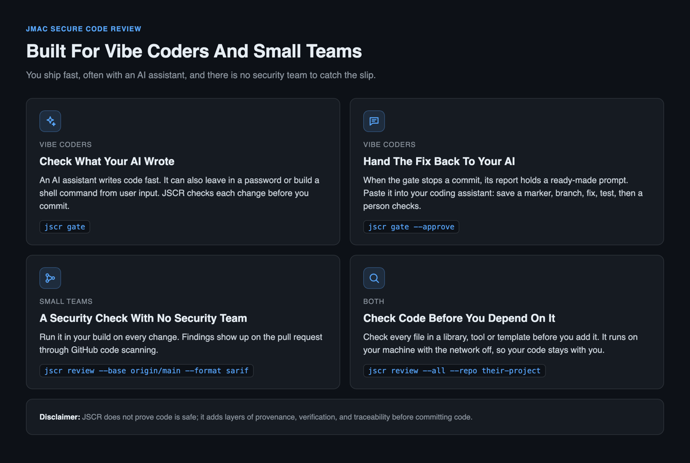
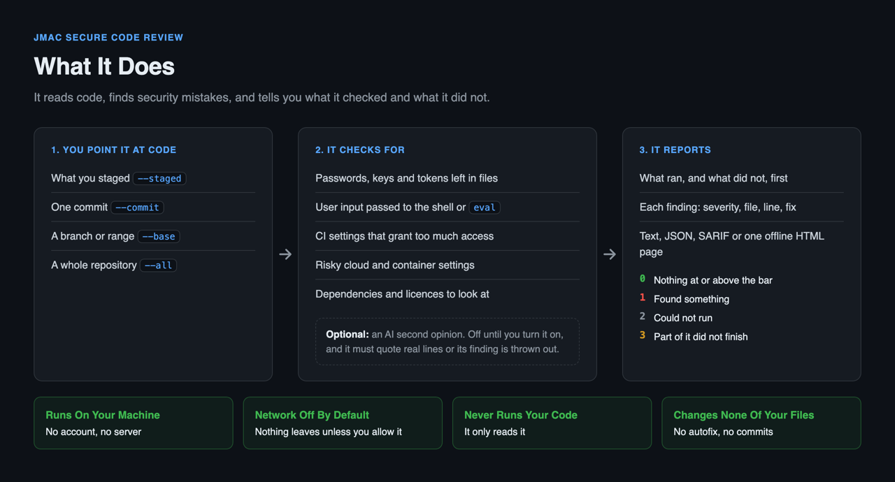

# JMac Secure Code Review (JSCR)

JSCR stands for JMac Secure Code Review.

JSCR reads code and points out security problems before they cause harm. It
finds things like passwords left in files, commands that let an attacker run
their own code, and build settings that give away too much power.

It runs on your own computer. By default it sends nothing anywhere. It never
runs the code it reads.

**Disclaimer:** JSCR does not prove code is safe; it adds layers of provenance, verification, and traceability before committing code.





```
git clone https://github.com/JMacCyber/JMac-Secure-Code-Review jscr
pip install ./jscr     # or run it in place: python -m jscr
jscr init
jscr review --staged
```

Not yet published to PyPI, and there is no tagged release yet. Install
from source.


Nothing else gets installed with it. `jscr init` writes a settings file with
the network turned off and no AI model. `jscr policy` prints what those
settings allow, before you run anything.

## What it does

You point JSCR at some code. It reads the code and gives you a list of
problems. Each problem has a severity (Critical, High, Medium, Low or Info),
the file and line, the line itself, and how to fix it.

It checks for things like:

- passwords, keys and tokens written into files;
- code that passes user input to the shell or to `eval`;
- build and CI settings that grant more access than they need;
- risky settings in cloud and container files;
- dependency lists and licences that need a second look.

It can also ask an AI model for a second opinion. That is off until you turn
it on. See [Adding a model](#adding-a-model).

## Why you need it

Most security holes are not clever. Someone commits a password. Someone
builds a shell command out of a web form. Someone copies a CI file that
hands every job write access. These mistakes are easy to make and easy to
miss in a busy review.

JSCR catches that kind of mistake at the moment it is cheapest to fix: before
the commit, or before you trust someone else's code.

A tool that reads your code can also leak it. So JSCR is built to be safe
itself:

1. **Nothing leaves your computer unless you allow it.** The network is off
   by default. Only one file in the project can make a network call, and
   `make egress-audit` checks every other file to prove it cannot.
2. **The code it reads cannot give it orders.** The code under review is
   treated as hostile. If a file contains text that tries to trick an AI
   model, JSCR reports it as a finding. The model has no power to act.
3. **A check that did not run is never reported as a pass.** If part of the
   review failed, JSCR says what failed and exits with code 3.

## Use 1: check your own change before you commit

Stage your change as normal, then run:

```sh
jscr review --staged
```

To make this happen on every commit, install the commit gate in your
repository. `jscr gate` scans what you staged and stops the commit if it
finds anything.

```sh
cp /path/to/jscr/tools/git-hooks/pre-commit .git/hooks/pre-commit
chmod +x .git/hooks/pre-commit
```

Replace `/path/to/jscr` with the folder you cloned. From then on, every
`git commit` runs the gate first. It uses no AI model and no network, so it
takes seconds, not minutes. A slow gate gets switched off, and a gate that is
off catches nothing.

When the gate stops a commit, it prints where the report is and three ways
forward:

| Next | What it does |
|---|---|
| `jscr gate --deep` | Check the same change again, this time with the AI model and scanners your settings allow |
| `jscr gate --approve` | Save a tag of the code as it is now, then make a branch to fix it on |
| `git commit --no-verify` | Commit anyway. You own that choice |

`--approve` adds two things to git and nothing else: a tag
`jscr-marker-<stamp>` that holds the exact code that was checked, and a
branch `jscr-fix-<stamp>` to fix it on. It writes no commit, moves no branch
and deletes nothing. The report also holds a ready-made prompt you can give
your own coding assistant: save the marker, branch, fix, test, then hand to a
person to check.

`JSCR_GATE_OFF=1` skips the gate once, and the gate says it was skipped.

This repository uses the same gate on itself:

```sh
git config core.hooksPath tools/git-hooks
```

Here the gate reports the test files in `tests/`. They hold deliberate
examples of unsafe code, so the rules are right to flag them.

## Use 2: check a repository before you use it

Before you add someone else's code to your project, you can check every file
in it:

```sh
git clone https://github.com/someone/their-project
jscr review --all --repo their-project --format html --output their-project-report.html
```

`--all` checks every file git tracks in that repository, not just a recent
change. `--head` picks a different branch or tag; the default is `HEAD`. Edits
that are not committed are left out.

Open the HTML file in any browser. It works offline.

Know what this check can and cannot tell you:

- It reads the source code only. It does not install the project or run it,
  so it cannot see what an install script does when it runs.
- It does not look up known vulnerabilities (CVEs) in the project's
  dependencies. `jscr sbom` lists those dependencies so you can check them
  with a tool that does.
- It reads CI files but does not run them.
- **No findings does not mean safe.** It means these checks found nothing.
  The report says exactly that.

Treat the report as a list of things to look at, not a verdict.

## Use 3: check every change in CI

```yaml
- run: pip install ./jscr
- run: jscr review --base origin/main --head HEAD --format sarif --output jscr.sarif
- uses: github/codeql-action/upload-sarif@v3
  with: { sarif_file: jscr.sarif }
```

SARIF is the format GitHub code scanning reads, so findings show up on the
pull request.

## Reading a result

```
$ jscr review --staged
------------------------------------------------------------------------
JMac Secure Code Review  -  staged changes
------------------------------------------------------------------------
1 finding(s): 1 High

What ran
------------------------------------------------------------------------
  AI review      not run: the null provider is configured
  builtin        1 finding(s) in 0.0s
  secrets        0 finding(s) in 0.0s

  Notes:
    - the null provider is configured: this run is deterministic scanning only

Findings
------------------------------------------------------------------------

  1. [High]     os.system runs a string through the shell
     app.py:6
     > os.system("echo " + user_input)
     Matched the deterministic rule py-os-system. This is a pattern
     match, so confirm that the value involved is attacker-influenced
     before treating it as exploitable.
     Fix: Use subprocess.run with an argument list.
     (CWE-78 - jscr/py-os-system - confidence 0.85 - scanner)

------------------------------------------------------------------------
Result: Red - 1 finding(s) need attention before merge.
```

Look at "What ran" first. It lists what ran **and what did not**, before it
lists what it found. If a check never ran, an empty section is not good news,
and the report makes sure you know that.

That run used no network at all. That is the default, and it is a full way to
use JSCR, not a cut-down one.

Exit codes tell a script what happened:

| Code | Meaning |
|---|---|
| `0` | Ran fully, nothing at or above the bar |
| `1` | Found something at or above the bar (default: High) |
| `2` | Could not run |
| `3` | Ran, but part of it did not finish |

Code 3 exists so a pipeline never reads "the AI model could not be reached"
as "no problems found". `--fail-on` sets the bar.

## The HTML report

Any command that finds something can also write one HTML page. It is a
single file. It loads no outside fonts or scripts and makes no network call
when you open it.


The result comes first, then what ran, then what was found, then what the
report does not cover. Click any row to see the full finding and its
evidence. More in [The HTML report](docs/reports.md).

## Commands

| Command | What it does |
|---|---|
| `jscr review` | Check code. Pick what to check with `--staged`, `--worktree`, `--commit <sha>`, `--base`/`--head`, or `--all` |
| `jscr gate` | The commit gate: check the staged change, write a report, stop for a person |
| `jscr init` | Write a locked-down `.jscr.json` settings file |
| `jscr config <key>` | Print one setting as it will be used |
| `jscr policy` | Print everything JSCR is allowed to do, and why |
| `jscr sbom` | Write a list of the project's declared dependencies (CycloneDX format) |
| `jscr doctor` | Check your setup: Python, git, scanners, and what would be sent |

Report formats: `text`, `json`, `sarif` (2.1.0, for code scanning) and
`html`.

## Adding a model

An AI model is off by default. Turning it on means opening the network to
exactly one host:

```json
{
  "version": 1,
  "egress": { "enabled": true, "allow_hosts": ["api.anthropic.com"] },
  "provider": {
    "name": "anthropic",
    "model": "claude-sonnet-5",
    "api_key_env": "ANTHROPIC_API_KEY"
  }
}
```

Before anything is sent, JSCR checks it for secrets. If it finds one, it stops
the send. It does not try to blank the secret out and send the rest.

The model must quote real lines from what it was given. A finding that
quotes something that is not there is thrown out, and the report records
that it was thrown out. There is no backup model. If the one you set up
fails, the run says so and exits 3.

## What it is allowed to do

JSCR has eight permissions. Each one is off or as small as possible by
default. All eight are decided in one file, `src/jscr/policy.py`. Print the
live state with `jscr policy`.

| Action | Default |
|---|---|
| `fs.read` | Inside the repository only |
| `net.connect` | **Denied** |
| `provider.use` | `null` (no network) |
| `exec.run` | **Denied** |
| `tool.call` | **Denied**, empty allowlist |
| `persist.write` | Metadata only |
| `telemetry.send` | **Denied**, and not built |
| `update.check` | **Denied** |

## Dependency list (SBOM)

`jscr sbom` writes a CycloneDX 1.5 file listing what the repository says it
depends on.

```sh
jscr sbom --output sbom.json
```

It reads the dependency files already in the project: `package-lock.json`,
`package.json`, `requirements*.txt`, `pyproject.toml`, `go.mod` and
`Cargo.toml`. For each dependency it records which file named it, which
ecosystem it is from, and whether it is needed to run or only to develop.

What it does not do:

- **It does not work out dependencies of dependencies.** It lists what the
  project declares. Only `package-lock.json` gives the full pinned list, so
  only npm projects get it.
- **It does not go online.** Nothing is checked against a vulnerability
  database.
- **An empty list is not an error.** A project can depend on nothing. That
  case exits 0 and says so, so a pipeline can tell it apart from a failure.

The file itself records these limits, so it stays honest when someone reads
it without this README.

On this repository it lists zero dependencies, because `pyproject.toml` says
`dependencies = []`. That is the right answer.

Releases will carry their own SBOM and checksums, built from the installed
package: see `.github/workflows/release.yml`. That is requirement SR-31 in
[security requirements](docs/security-requirements.md).

## What it does not do

A security tool that claims too much is worse than none, so here are the
limits:

- **It does not change your code.** No autofix. It writes no commit and edits
  no file you wrote. `jscr gate --approve` is the only command that touches
  git, and it only adds a tag and a branch.
- **It does not prove code is safe.** No findings means these checks found
  nothing.
- **Its built-in rules are a floor, not a full static analyser.** What they
  catch is measured: `make ground-truth` scans a set of planted bugs and
  reports every rule that missed one.
- **It reads only inside the repository.** The only thing it writes there is
  a report, and only when you ask: the `--output` path you name, or
  `.jscr/reports/` for `jscr gate`. Add `.jscr/` to `.gitignore` if you do not
  want reports tracked.

## Requirements

Python 3.9 or newer, and `git`. Nothing else. Having no dependencies is a
security choice: nothing extra can be swapped out from under you. See
[ADR 0004](docs/adr/0004-zero-runtime-dependencies.md).

## Documentation

- [Capability map](docs/capability-map.md): everything it can do, and what decides it
- [Behaviour](docs/behaviour.md): the steps of a run, exit codes, and what is and is not promised
- [Threat model](docs/threat-model.md): who might attack it, how, and what stops them
- [Security requirements](docs/security-requirements.md): SR-1 to SR-31, where each lives and how it is checked
- [Architecture](docs/architecture.md) · [Data flow and trust boundaries](docs/data-flow.md)
- [Acceptance tests](docs/acceptance-tests.md): the attack tests, and the planted-bug set the scanners are scored against
- [The HTML report](docs/reports.md) · [Bill of materials](docs/sbom.md) · [Configuration](docs/configuration.md) · [ADRs](docs/adr/)

## Status and licence

Version 0.1.0 in the source tree. Nothing is released yet: there is no tag,
no GitHub release and no signed artefact. The security properties are built
and tested. The rule set and AI provider support are early.

Apache-2.0. Written independently: see
[PROVENANCE.md](PROVENANCE.md) and [ADR 0001](docs/adr/0001-clean-room-independent-implementation.md).
Report vulnerabilities as described in [SECURITY.md](SECURITY.md).
