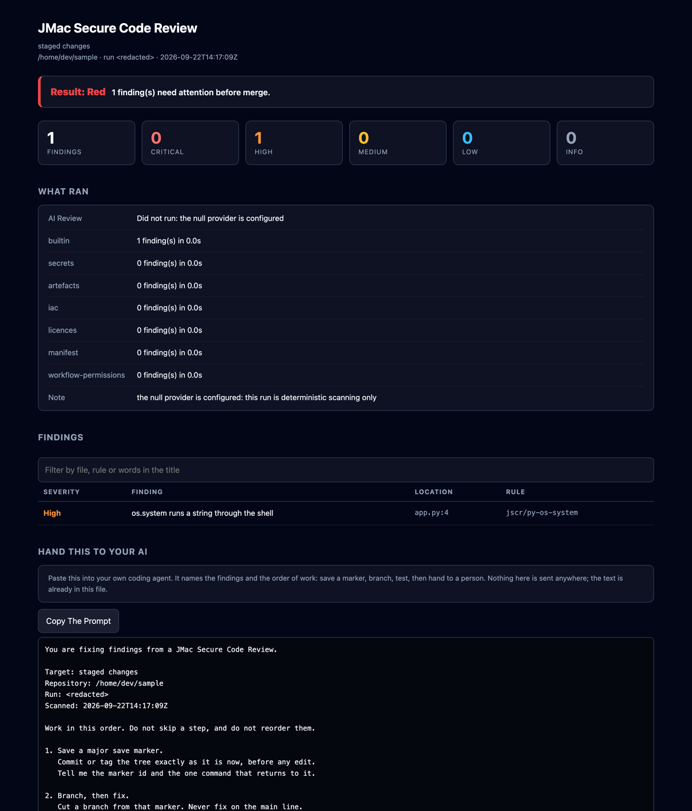
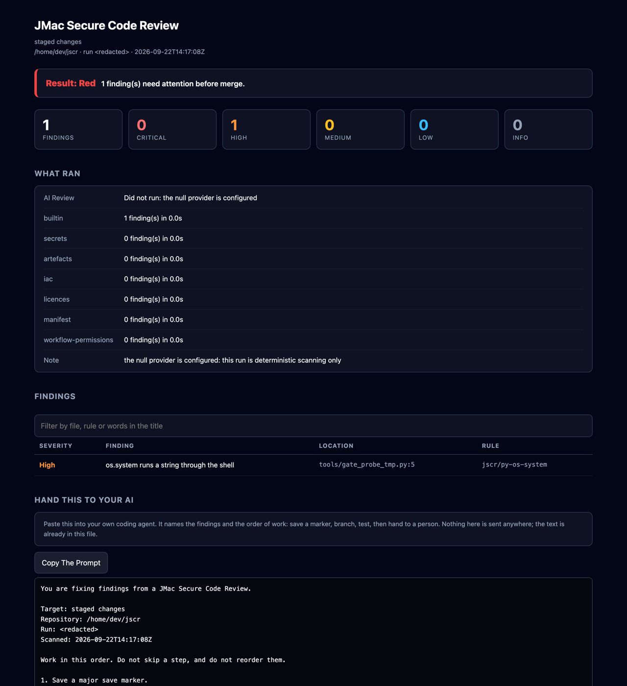
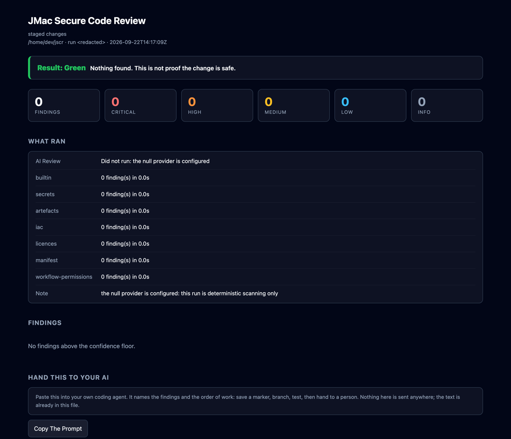
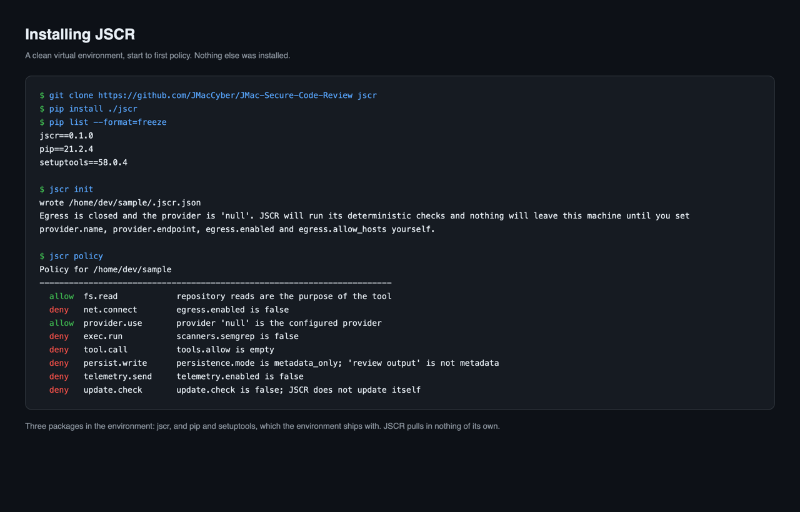

# The HTML report

Every command that finds something can write a self-contained HTML page next to
its JSON. One file, no external fonts, no external scripts, no network call when
you open it. Put it in a pull request, mail it, or open it from a USB stick.

The pages below are real runs. The repository names, paths and commit hashes in
them have been replaced, because the code they scanned is not public. Nothing
else was edited. The sources are in [`examples/reports/`](../examples/reports).

## A review of a staged change



This one came from a fresh install into an empty virtual environment, run
against a four-line file that passes a name straight to `os.system`. It is the
whole product in one page: the result, what ran, what did not, one finding
anchored to a real line, and a prompt you can hand to your own coding agent.

Exit code 1. Findings, not an error. Exit 2 means it could not run and exit 3
means it ran but part of it did not.

## A commit the gate refused



Read it top down. The result line comes first, then **What Ran** — including the
row that says the AI review did not run — and only then the findings.

That order is the point. A reviewer who does not know the dependency scanner
never ran will read an empty dependency section as good news. So the page says
what did not run before it says what it found.

The prompt block at the bottom is for handing the findings to your own coding
agent. It names the findings and the order of work. It is text in the file;
nothing is sent anywhere.

## A commit the gate passed



Green here means the rules that ran found nothing. It does not mean the
repository is safe. The **What This Report Does Not Cover** block at the foot of
every page says so in words, on the page, not in a footnote.

## A bill of materials

`jscr sbom` writes CycloneDX JSON. There is no sample page here: the only run
with real manifests to show was over a private repository, and an inventory of
someone's dependencies is theirs, not an illustration.

See [Bill of materials](sbom.md) for the manifests it reads and the four limits
that follow from reading manifests only.

## Reproducing these pages

```
jscr review --staged --format html --output report.html
jscr gate --output gate.html
jscr sbom --repo . --output sbom.json
```

`review` and `gate` write the HTML themselves. `sbom` writes CycloneDX JSON
only; the bill of materials page above was rendered from that JSON by a
separate script, and there is no `jscr sbom --format html` yet.

The PNGs were rendered from the HTML at 1280px wide. No image was retouched.

## Installing it



Three packages in the environment afterwards: `jscr`, plus the `pip` and
`setuptools` the virtual environment ships with. JSCR has no runtime
dependencies, and `pip list` is the check, not the claim.

`jscr init` writes a `.jscr.json` with egress closed and the provider set to
`null`. `jscr policy` prints what that configuration permits, one line per
capability, with the reason it is allowed or denied. Read it before the first
review, not after.
